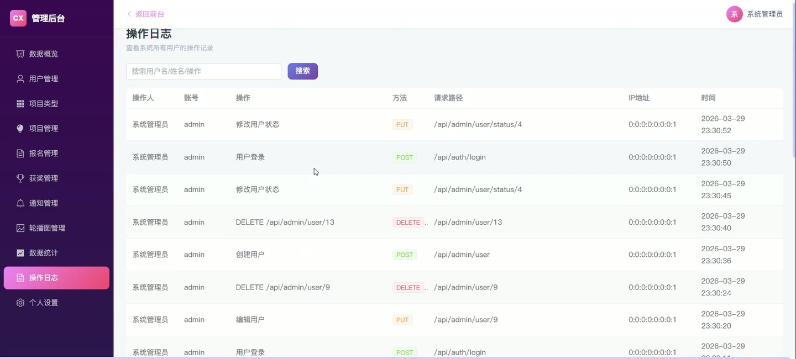
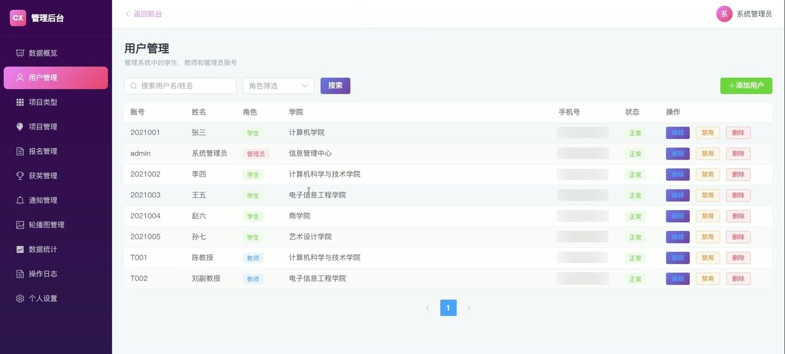
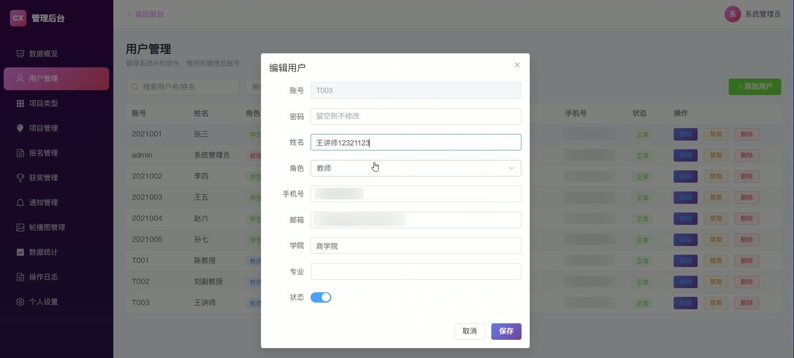

# (附文档)Springboot3+Vue3+MySQL 高校大学生创新创业项目管理与评审系统

**技术栈**：Springboot3、Vue3、MySQL

### 系统简介

本系统是一套面向高校创新创业项目全流程管理的平台，采用前后端分离架构（Springboot3 + Vue3），支持学生端、教师端、管理员端三大角色。系统围绕项目发布、报名审核、指导申请、获奖申报、通知公告、团队管理、数据统计等核心业务，提供完整的项目生命周期管理与评审能力。
 
### 核心功能
 
### 普通用户端

 
- 浏览项目列表（支持按关键词搜索、按类型/进度筛选、按热度或时间排序） 
- 查看项目详情（展示封面、描述、要求、评审标准、报名时间、最大成员数、热度） 
- 报名参与项目（填写团队名称、成员、申请理由，自动检测是否已报名） 
- 查看我的报名记录（按审核状态筛选，查看审核意见与审核时间） 
- 提交指导申请（选择教师、填写申请内容，查看审核状态与教师反馈） 
- 收藏/取消收藏项目（一键切换收藏状态，收藏列表展示已收藏项目） 
- 创建团队（填写团队名称、描述，添加团队成员信息：姓名、角色、专业、电话） 
- 编辑/删除团队（仅创建者可操作，更新时重新设置成员列表） 
- 查看我参与的获奖记录（获取本人已通过审核的项目获奖情况） 
- 查看我的通知（系统通知 + 教师定向推送的通知，标记已读状态） 
- 浏览教师列表（查看教师姓名、学院、职称、研究方向，用于指导申请） 
- 查看公开获奖公示（浏览所有已审核公开的获奖记录） 
- 查看系统统计数据（项目总数、报名总数、获奖总数、类型总数） 
- 个人资料管理（修改个人信息，修改密码，重置密码为123456）
 
### 管理员端

 
- 用户管理（分页列表，按关键词/角色搜索，新增/编辑/删除用户，启用/禁用账号） 
- 项目类型管理（新增/编辑/删除类型，设置排序号与启用状态） 
- 项目管理（查看全部项目列表，新增/编辑/删除项目） 
- 报名审核（查看所有报名记录，按项目/审核状态筛选，审核通过/驳回并填写审核意见） 
- 获奖审核（查看获奖申报记录，审核通过/驳回，设置是否公开显示） 
- 通知管理（发布系统通知，编辑/删除通知，通知面向指定角色或全部用户） 
- 轮播图管理（新增/编辑/删除轮播图，设置标题、图片、链接、排序、启用状态） 
- 数据统计（查看项目数/报名数/通过数/获奖数/获奖率，近30天每日申报量/报名量/获奖量，近12周每周趋势图） 
- 操作日志（查看所有用户的操作记录，包括操作人、操作内容、IP地址、请求方法、URL）
 
### 教师端

 
- 项目管理（查看我指导的项目列表，按关键词搜索） 
- 报名审核（查看项目报名列表，按项目/状态筛选，审核通过/驳回并填写意见） 
- 指导申请审核（查看学生发起的指导申请，审核通过/驳回并填写反馈意见） 
- 项目进度更新（修改项目当前进度状态，如招募中/进行中/已结题） 
- 获奖申报（提交项目获奖记录，填写获奖名称、级别、时间、证书图片） 
- 查看我的获奖记录（查看本人提交的获奖申报及审核状态） 
- 发布项目通知（填写标题、内容，可选择指定接收学生，定向推送） 
- 查看已发布通知（管理自己发布的项目通知） 
- 查看系统通知（接收管理员发布的面向教师的系统通知） 
- 查看学生列表（浏览全部在校学生信息：姓名、学院、专业、年级） 
- 查看个人操作日志（记录本人的所有操作行为） 
- 个人资料管理（修改个人信息，修改密码）
 
### 技术栈

 后端框架Spring Boot 3.x ORMMyBatis-Plus（含分页插件） 权限认证JWT（Token 鉴权） + 自定义拦截器 前端框架Vue 3（Composition API + setup 语法） 状态管理Vue Router（路由级权限控制） 构建工具Vite 数据库MySQL 8.x 文件上传MultipartFile + 本地存储 密码加密BCrypt（PasswordUtils 工具类）
 
### 交付内容

 
- 后端完整源码 
- 前端完整源码 
- 数据库初始化脚本 
- 万字文档

## 界面展示

---

## 获取完整源码 + 万字文档

本仓库为项目介绍页。**完整前后端源码、数据库初始化脚本、万字项目文档**，请加微信 `kangkangcode`，或访问 [codekk.top](http://codekk.top) 获取。

可作课程设计 / 毕业设计参考，支持远程部署调试。